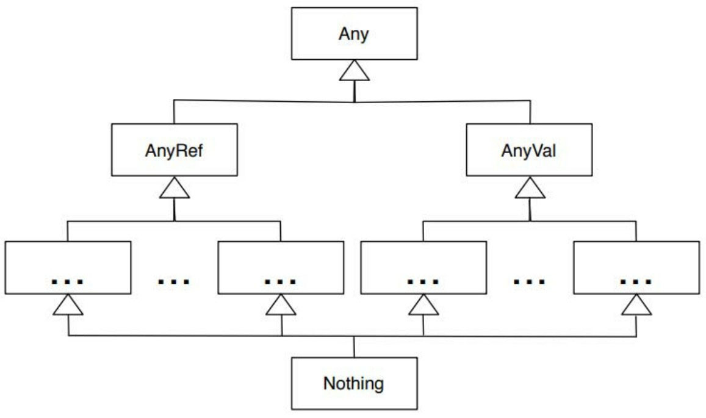

## 善用类型

类型推断无法发挥作用的地方，需要显式指明类型

1. 没有初始值的类字段
2. 定义函数或者方法的参数时
3. 函数或方法的返回类型，使用显式的return和递归时
4. 类型推断不满足意图时，例如 `val money: Double = 1`

Scala对对象的类型是非常谨慎的。它禁止任何可能导致类型问题的转换。

在Scala中，`Nothing`是一切类型的子类型

只有当你使用等号（=）将方法的声明和方法的主体部分区分开时[插图]，Scala的返回值类型推断才会生效。否则，该方法将会被视为返回一个Unit，等效于Java中的Void。

任何返回Unit的方法都必须产生副作用，如果它没有返回值，并且没有产生副作用，那么它将是无用的，什么也不会做。因此，可以将这一的方法标记为()，并且在调用的时候也使用圆括号。

Scala默认的型变是不变的

协变和逆变

> 在期望接收一个基类实例的集合的地方，能够使用一个子类实例的集合的能力叫作协变（covariance）。而在期望接收一个子类实例的集合的地方，能够使用一个超类实例的集合的能力叫作逆变（contravariance）。在默认的情况下，Scala都不允许（即不变）。

显式支持协变

```scala

```

> T <: Pet表明由T表示的类派生自Pet类。这个语法用于定义一个上界（如果可视化这个类的层次结构，那么Pet将会是类型T的上界），T可以是任何类型的Pet，也可以是在该类型层次结构中低于Pet的类型。

你可以通过将参数化类型标记为+T而不是T来完成这项操作；同样，通过使用参数化类型-T而不是T，我们可以要求Scala为自己的类型提供逆变支持。


Scala认为，没有指定参数化类型的集合是元素类型为Nothing的集合，并限制了跨类型的赋值。为什么不是Any?

类型继承关系



AnyVal 是所有值类型的基础类型
AnyRef 是所有引用类型的基础类型


关于Nothing: 在类型验证上很重要，假设一个函数或者方法里会返回Int或者抛出异常，抛出异常后的返回类型最好是Int的子类型，否则会导致这个方法的返回类型不一致，而使用Nothing类型作为返回值则可以完美解决


**Option**

对数据的封装，就像一个盒子，里面可能有东西，也可能没有东西；里面可能是一个值，也可能是另外一个盒子；Option不会对值进行解包，需要自行处理

```scala
val opt1 = Option(10)
val opt2 = Option(opt1)
val opt3 = Option(Option(opt2))

println(s"opt1 = ${opt1.get}")
println(s"opt2 = ${opt2.get.get}")
println(s"opt3 = ${opt3.get.get.get.get}")
```

**Either**

Option的问题在于只能返回一个类型的值，而Either则解决了这个问题，可以返回两个不同类型的值，同时遵循: Right means right，即右侧的值是对的，左侧的值是异常或者错误

```scala
object UsingEither extends App {
  val e1: Either[Error, Int] = Left(new Error("not found"))
  val e2: Either[Error, Int] = Right(120)
  val ee1: Either[Either[Error, Int], Int] = Right(10)
  val ee2: Either[Either[Error, Int], Int] = Left(Right(10))
  println(s"e1 is right: ${e1.isRight}")
  println(s"e2 is right: ${e2.isRight}")
  println(s"ee1 is right: ${ee1.isRight}")
  println(s"ee2 is right: ${ee2.isRight}")
}
```

**返回值类型**

Scala会尝试推断函数返回值，但是具体怎么推断取决于如何定义函数

如果在定义时没有使用 `=`，那么会默认认为返回值为`Unit`

如果使用了 `=`，那么会根据最后一个表达式的返回值来确定返回值的类型

> 任何返回Unit的方法都必须产生副作用，如果它没有返回值，并且没有产生副作用，那么它将是无用的，什么也不会做。因此，可以将这一的方法标记为()，并且在调用的时候也使用圆括号。

也就是说，不要定义没有任何副作用且返回Unit的方法或函数，这是无意义的


**参数类型的型变**

默认情况下，Scala的函数和方法参数时不变的，即不支持协变和逆变

如何显式设置支持协变?

> T <: Pet表明由T表示的类派生自Pet类。这个语法用于定义一个上界（如果可视化这个类的层次结构，那么Pet将会是类型T的上界），T可以是任何类型的Pet，也可以是在该类型层次结构中低于Pet的类型。

```scala
class Pet(val name: String) {
    override def toString: String = name
}

class Dog(override val name: String) extends Pet(name)

def playWithPets[T <: Pet](pets: Array[T]): Unit = println("Playing with pets: " + pets.mkString(", "))
```

如何显式地支持逆变?

```scala
def copyPets[S, D >: S](fromPets: Array[S], toPets: Array[D]): Unit = {}

val pets = new Array[Pet](10)

copyPets(dogs, pets)
```

**隐式类型转换**

> 实现类型转换有两种不同的方式——编写隐式函数和创建隐式类

> 通过隐式类型转换，你可以扩展编程语言，从而创建特定于你自己的应用程序/领域的词汇表，或者创建你自己的领域特定语言。

隐式类型转换可以极大地丰富编程手段，甚至创建自己的领域语言

> 相对于创建一个常规类和一个单独的隐式转换方法，你可以告诉Scala，某个类的唯一目的就是作为一种适配器或者转换器

注意: 它不能是一个独立的类，它必须要在一个单例对象、类或者特质中。


**值类**

> 频繁使用隐式类结果就是：所做的隐式转换越多，所创建的短生命周期的垃圾对象也就越多。

一个值类可以给你世界上最好的两样东西：更好的设计以及更富表现力的代码，并且不需要使用显式的对象。


**使用隐式转换**

